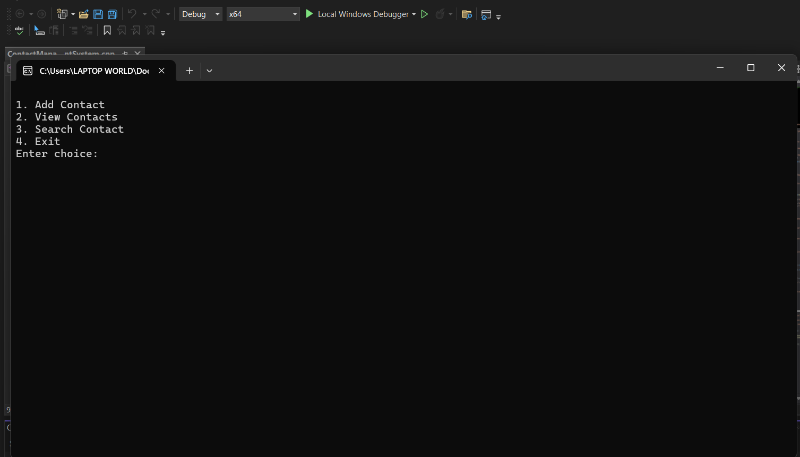

# 📒 Contact Management System

A console-based Contact Management System developed in **C++** using **File Handling**.

## ✨ Features

- ➕ Add Contact
- 📋 View Contacts
- 🔍 Search Contact

## 🛠 Technologies

- C++
- File Handling
- Visual Studio
- Git
- GitHub

## ▶️ How to Run

1. Clone the repository.
2. Open `ContactManagementSystem.sln` in Visual Studio.
3. Build and Run the project.

## 📁 Data Storage

The application automatically creates `phonebook.dat` to store contacts.

## 👩‍💻 Author

**Rana Bakr**
